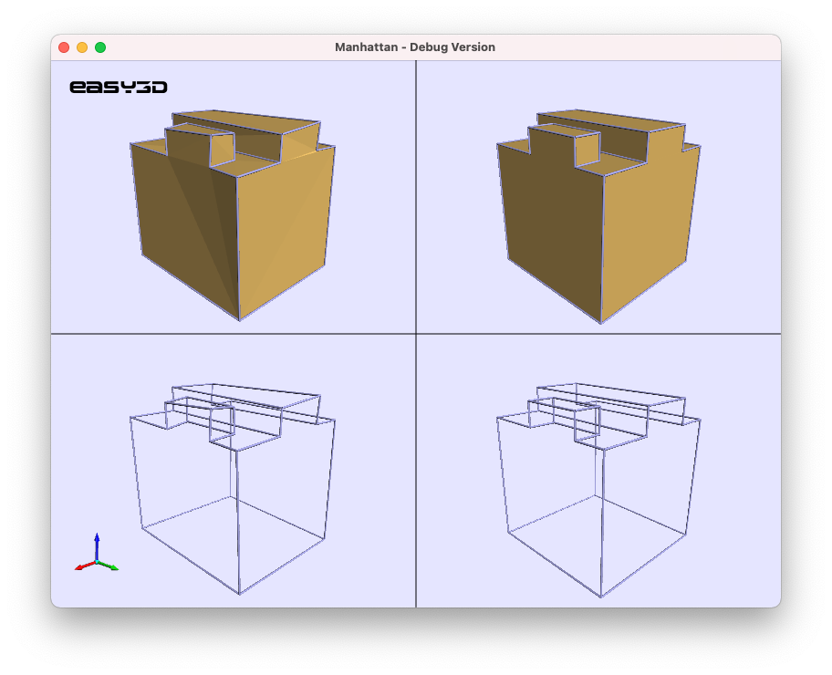

# Manhattan
Given a polygonal mesh, Manhattan makes 
 - all consecutive edges orthogonal
 - all faces planar

 
      

 
 ## How to build it:
 - Grab the source code of [Easy3D](https://github.com/LiangliangNan/Easy3D) and build it.
 - Point `Easy3D_DIR` to your build directory of Easy3D when doing cmake.
 - Build and run.
